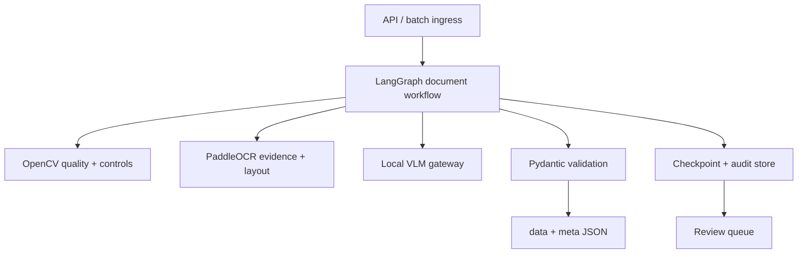
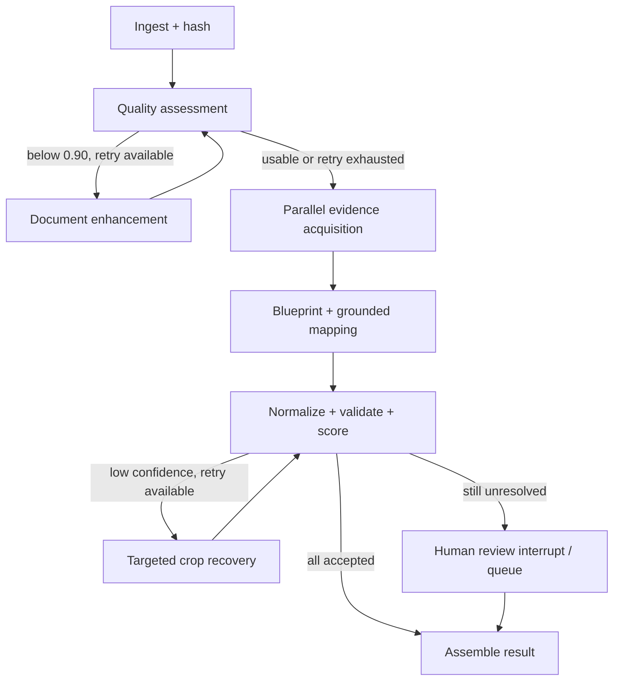

# Architecture

## 1. System boundary

DocuOCR processes private form images entirely inside an approved network. It exposes one stable extraction contract while allowing OCR, layout, VLM, storage, and execution runtimes to evolve behind adapters.



The VLM gateway accepts loopback/private endpoints only when explicitly configured. It is an adviser, not the source of truth.

## 2. Document graph



Parallel evidence acquisition consists of layout parsing, exhaustive OCR, and form-control detection. A join node waits for all three before field mapping.

## 3. Bounded self-resolution

The recovery planner chooses only from an enum of approved, deterministic actions:

| Failure signal | Targeted action | Re-verification |
| --- | --- | --- |
| small text | crop, 2x/3x Lanczos upscale | PaddleOCR crop + VLM crop |
| low contrast | CLAHE | rerun recognizer |
| uneven illumination | background normalization / adaptive threshold | rerun recognizer |
| blur | denoise + unsharp mask | rerun and compare |
| skew | estimated affine deskew | rerun affected page |
| ambiguous checkbox | border suppression + binary variants | consensus of fill classifiers |
| glare/occlusion | no destructive repair | human review |

The graph has a document-quality retry limit and a field-recovery retry limit. It never recursively asks the model to “try something else.” Every retry records the selected strategy, parameters, before/after score, and artifact hash.

## 4. Grounding contract

Every OCR line, layout block, checkbox/radio control, and crop receives a stable evidence ID. A semantic proposal has this internal form:

```json
{
  "path": "data.baby.dateOfBirth",
  "rawValue": "12/08/2024",
  "normalizedValue": "2024-08-12",
  "evidenceIds": ["ocr:p1:0042"],
  "source": "vlm_grounded",
  "attempt": 1
}
```

The gateway rejects a proposal when:

- its field path is not in the blueprint;
- any evidence ID is unknown;
- a string value is not supported by cited OCR text;
- a boolean is not supported by a cited control state;
- normalization cannot be reproduced by deterministic code.

The VLM's own confidence is ignored.

## 5. Confidence model

Each field score is computed from independently observable components:

- image/crop quality;
- recognition score;
- label-to-value association;
- agreement between independent passes;
- deterministic validation;
- evidence grounding.

The starter uses a weighted geometric mean with safety caps:

- missing evidence: `0.00`;
- failed validation or impossible cross-field state: at most `0.49`;
- conflicting recognizers: at most `0.59`;
- only one supporting source: at most `0.89`.

Therefore an auto-accepted value at `>=0.90` normally requires grounded evidence, validation, and an independent confirmation. The `calibrated` flag stays false until a held-out labelled set is used to fit and verify calibration.

Stage confidence is separate from field confidence. A high average OCR score cannot hide one unsafe critical field.

## 6. Form variability

Forms are handled with versioned blueprints rather than code branches. A blueprint contains:

- document identifiers and anchor phrases;
- multilingual aliases per canonical field;
- geometry strategies (`right_of_label`, `below_label`, checkbox group);
- normalization and validation rules;
- required/critical flags;
- template-specific ROIs when available.

Resolution order:

1. known-template registration and ROIs;
2. alias + geometry rules;
3. layout-aware local VLM mapping with evidence IDs;
4. review.

Blank form templates are especially valuable. After homography alignment, checkbox and fixed-field ROIs become far more reliable than generic detection.

## 7. Output contract

The public result has exactly two top-level keys: `data` and `meta`.

- `data` contains normalized business values.
- `meta.pre` contains raw pre-normalization values for the requested subset.
- `meta.processors.steps` contains stage confidence, timings, model identifiers, decisions, warnings, and evidence references.
- `meta.processors.fields` contains per-field score, disposition, attempts, and evidence references.
- `meta.timing` contains the requested aggregate timings plus a per-step map.

The Pydantic contract serializes camelCase names such as `dateOfBirth`, `birthTime`, and `createDocumentBlueprint` while the Python implementation uses snake_case internally.

## 8. Traceability and privacy

`trace.jsonl` is append-only and idempotent. Event IDs are derived from run, node, attempt, and input hash so a resumed LangGraph node does not duplicate a side effect. A trace event records:

- run/job/thread ID;
- node and attempt;
- start/end/duration;
- input/output hashes;
- model and configuration identity;
- confidence and routing decision;
- evidence and artifact references;
- error/warning codes.

Patient values are not written into trace events by default. Evidence images should be encrypted at rest and deleted according to an explicit retention policy.

## 9. Runtime profiles

### Developer workstation

- SQLite LangGraph checkpointer;
- local artifact directory;
- one in-process worker;
- Paddle adapters or sidecar/mock evidence.

### Production on-prem

- FastAPI ingress;
- queue-backed workers;
- PostgreSQL LangGraph checkpointer;
- encrypted S3-compatible object storage;
- PaddleOCR service pool;
- local VLM model gateway with concurrency and memory limits;
- local OpenTelemetry collector;
- reviewer application using LangGraph interrupts or a review queue.

Do not place image bytes in LangGraph checkpoints. Store artifact references and hashes in graph state; keep large bytes in the artifact store.

## 10. Evaluation gates

Before production auto-acceptance, evaluate by form family, script, printed/handwritten status, and field criticality:

- OCR character/word error rate;
- layout and field detection recall;
- exact match per canonical field;
- checkbox state and label-association accuracy;
- normalization accuracy;
- calibration error and reliability plots;
- false auto-accept rate at the 0.90 threshold;
- review rate and recovery gain;
- latency, peak RAM/VRAM, and retry distribution.

The launch criterion should be a bounded false auto-accept rate on critical fields, not a single average accuracy.

